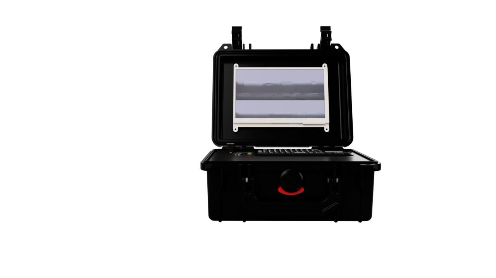
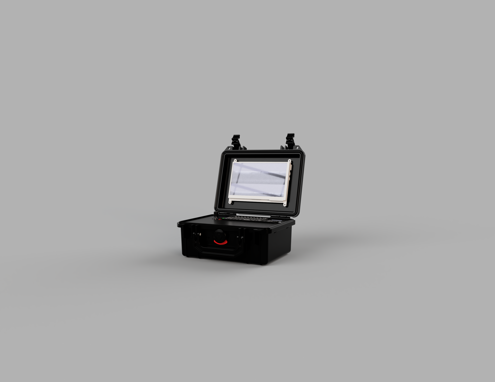
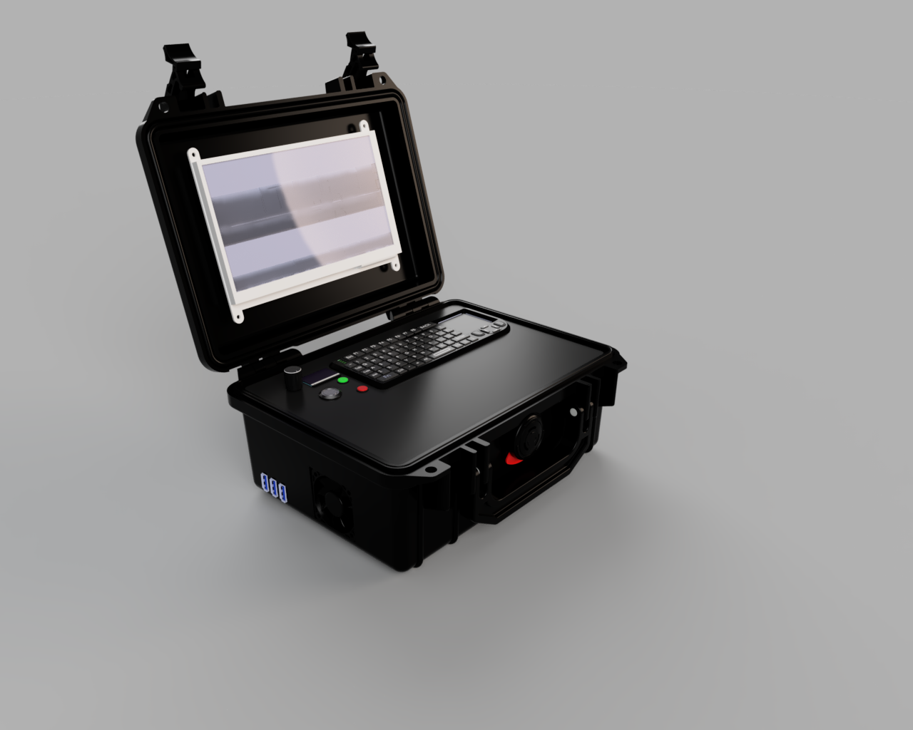
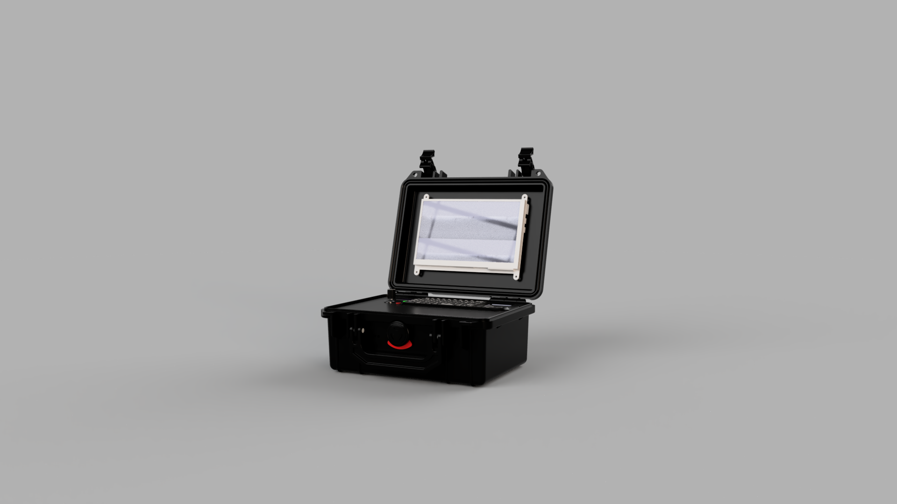

K2B + 7" touchscreen, UPS-powered, OLED status display, rotary encoder, dual indicator LEDs, custom panel-mount controls in a cyberdeck

## What is it?
Im uisng a KickPi K2B which is actually almost nothing like a RPi as its an Allwinner H618 board that ships with Android TV on it and as far as I can tell is made to be used as an Android TV box with its IR sensor onboard and of course the OS that comes with it but it supports Ubuntu and Android according to the docs! Im trying to turn this into a cyberdeck inside of a Pelican case or similar 

## Status
currently this project is in its build phase! late stage i would say...
### Confirmed/Working parts 
- everything!

### Current Issues
- display driver issues with the 7 inch display... the os doesnt like it :(

## The current build/concept
**brain:** KickPi K2B V1.1  
**screen:** 7" 1024x600 HDMI touchscreen (2 micro USB cables, one's power, one's touch data)  
**power:** Waveshare UPS HAT (E), 4x 21700 Li-ion cells, 6A output  
**input:** mini keyboard w/ built-in touchpad  
**extras:** SSD1306 OLED, EC11 rotary encoder, panel-mount LED indicators, 16mm self-locking power button, small 5V fan  
**case:** mini pelican-style, ~9.84" external width  

full parts list with prices/links/status is going to be in the BOM and below this text, the pinout is now finalized and everything is soon to be submitted

BOM (click to expand)

| Item | Qty | Unit Price | Link | Status |
|---|---|---|---|---|
| KickPi K2B V1.1 | 1 | $55.99 | [link](https://www.amazon.com/KICKPI-K2B-Development-Allwinner-Alternative/dp/B0DP64TCMM) | Purchased |
| 7" HDMI touchscreen display | 1 | $49.16 | [link](https://www.aliexpress.us/item/3256808052500489.html) | Purchased |
| 21700 Flat Top Li-ion battery | 4 | $8.99 | [link](https://www.18650batterystore.com/products/molicel-p42a) | Unpurchased |
| Power toggle button | 1 | $5.05 | [link](https://www.aliexpress.us/item/3256808032650879.html) | Unpurchased |
| Mini keyboard w/ touchpad | 1 | $9.30 | [link](https://www.aliexpress.us/item/3256805678693083.html) | Unpurchased |
| USB hub | 2 | $2.16 | [link](https://www.aliexpress.us/item/3256805881712545.html) | Unpurchased |
| Mini Pelican-style case | 1 | $21.33 | [link](https://www.aliexpress.us/item/3256811877732636.html) | Unpurchased |
| OLED status display | 1 | $2.89 | [link](https://www.aliexpress.us/item/3256809030882696.html) | Purchased |
| Indicator LEDs | 1 | $6.57 | [link](https://www.aliexpress.us/item/3256809134773636.html) | Unpurchased |
| Small 5v fan | 1 | $2.62 | [link](https://www.aliexpress.us/item/3256806120222119.html) | Unpurchased |
| UPS HAT (E) | 1 | $32.99 | [link](https://www.waveshare.com/ups-hat-e.htm) | Unpurchased |
| EC11 Rotary Encoders | 1 | $3.26 | [link](https://www.aliexpress.us/item/3256811428797543.html) | Unpurchased |
| **Total** | | **$229.44** | | |
| **Left to purchase** | | **$121.40** | | |
| **Estimated on sale price (left to purchase)** | | **~$90.99** | | |

## Current design
Full internal layout, K2B, both USB hubs, UPS HAT (E), fan, and every wire traced end to end (touch/screen power/HDMI, USB hub connections, AUX split, UPS charging):

Fan is positioned for a clear, unobstructed path to the K2B and runs as exhaust, pulling heat off the board and out through the case wall, with other cutouts (UPS I/O, hub ports, AUX hole) doubling as passive intake. Logo placement: top-center, outside of the case.

## Renders

