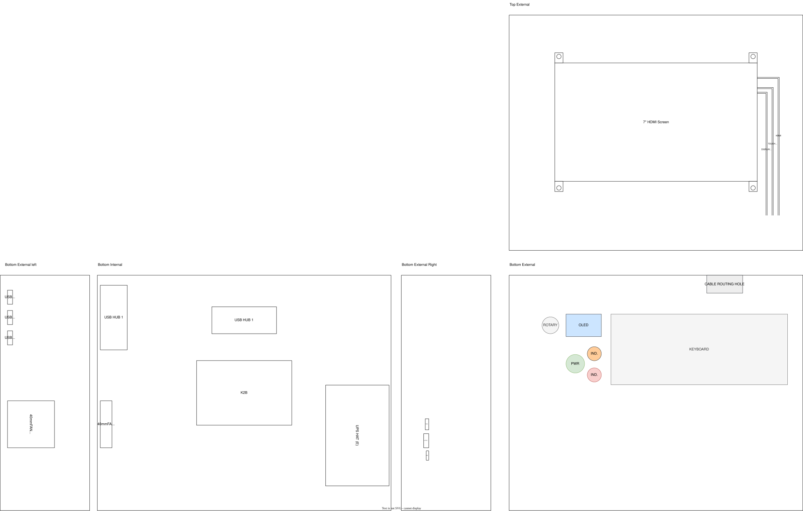

K2B + 7" touchscreen, UPS-powered, OLED status display, rotary encoder, dual indicator LEDs, custom panel-mount controls in a cyberdeck

## What is it?
Im uisng a KickPi K2B which is actually almost nothing like a RPi as its an Allwinner H618 board that ships with Android TV on it and as far as I can tell is made to be used as an Android TV box with its IR sensor onboard and of course the OS that comes with it but it supports Ubuntu and Android according to the docs! Im trying to turn this into a cyberdeck inside of a Pelican case or similar 

## Status
Design phase is essentially complete, the full internal layout, wiring, and component placement have been mapped out into a scaled draw.io diagram (see below), covering both hubs, the UPS HAT, fan placement/airflow direction, AUX routing, and the OLED/rotary encoder cluster. Nothing is physically built yet, no hardware purchased beyond what I already owned (K2B, display, OLED), nothing wired or flashed. Currently all of my progress can be found [here](JOURNAL.md) 
### Confirmed/Working parts 
- K2B V1.1 + 7" display both power on and work
- touch input works
- display's mounting holes are good

### Current Issues
- stock android TV has no back button and the operating system has almost nothing on it, so its kinda useless as a cyberdeck
- KickPi's own PDF on the website contradicts its self a couple times where it says it runs on 12V in one table and Type-C 5V in the power supply row, 5v is correct since it only has a USB c port no 12V barrel input onboard, its raw GPIO pin name table also doesn't match the actual pinout diagram????

## The current build/concept
**brain:** KickPi K2B V1.1  
**screen:** 7" 1024x600 HDMI touchscreen (2 micro USB cables, one's power, one's touch data)  
**power:** Waveshare UPS HAT (E), 4x 21700 Li-ion cells, 6A output  
**input:** mini keyboard w/ built-in touchpad  
**extras:** SSD1306 OLED, EC11 rotary encoder, panel-mount LED indicators, 16mm self-locking power button, small 5V fan  
**case:** mini pelican-style, ~9.84" external width  

full parts list with prices/links/status is going to be in the BOM and below this text, the pinout already has all of the pin assignments but some are TBD 

BOM (click to expand)

| Item | Qty | Unit Price | Link |
|---|---|---|---|
| KickPi K2B V1.1 | 1 | $55.99 | [link](https://www.amazon.com/KICKPI-K2B-Development-Allwinner-Alternative/dp/B0DP64TCMM) |
| 7" HDMI touchscreen display | 1 | $49.16 | [link](https://www.aliexpress.us/item/3256808052500489.html) |
| 21700 Flat Top Li-ion battery | 4 | $8.99 | [link](https://www.18650batterystore.com/products/molicel-p42a) |
| Power toggle button | 1 | $5.05 | [link](https://www.aliexpress.us/item/3256808032650879.html) |
| Mini keyboard w/ touchpad | 1 | $9.30 | [link](https://www.aliexpress.us/item/3256805678693083.html) |
| USB hub | 2 | $2.16 | [link](https://www.aliexpress.us/item/3256805881712545.html) |
| Mini Pelican-style case | 1 | $21.33 | [link](https://www.aliexpress.us/item/3256811877732636.html) |
| OLED status display | 1 | $2.89 | [link](https://www.aliexpress.us/item/3256809030882696.html) |
| Indicator LEDs | 1 | $6.57 | [link](https://www.aliexpress.us/item/3256809134773636.html) |
| Small 5v fan | 1 | $2.62 | [link](https://www.aliexpress.us/item/3256806120222119.html) |
| UPS HAT (E) | 1 | $32.99 | [link](https://www.waveshare.com/ups-hat-e.htm) |
| EC11 Rotary Encoders | 1 | $3.26 | [link](https://www.aliexpress.us/item/3256811428797543.html) |
| **Total** | | **$229.44** | |
| **Left to purchase** | | **$121.40** | |
| **Estimated on sale price (left to purchase)** | | **~$90.99** | |

## Current design
Full internal layout, K2B, both USB hubs, UPS HAT (E), fan, and every wire traced end to end (touch/screen power/HDMI, USB hub connections, AUX split, UPS charging):

Fan is positioned for a clear, unobstructed path to the K2B and runs as exhaust, pulling heat off the board and out through the case wall, with other cutouts (UPS I/O, hub ports, AUX hole) doubling as passive intake. Logo placement: top-center, outside of the case.
